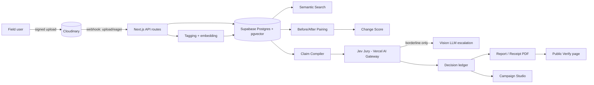
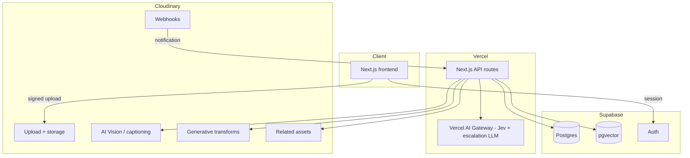
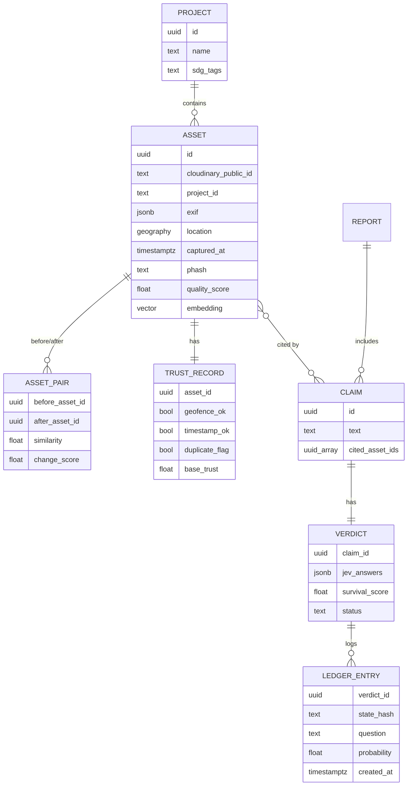
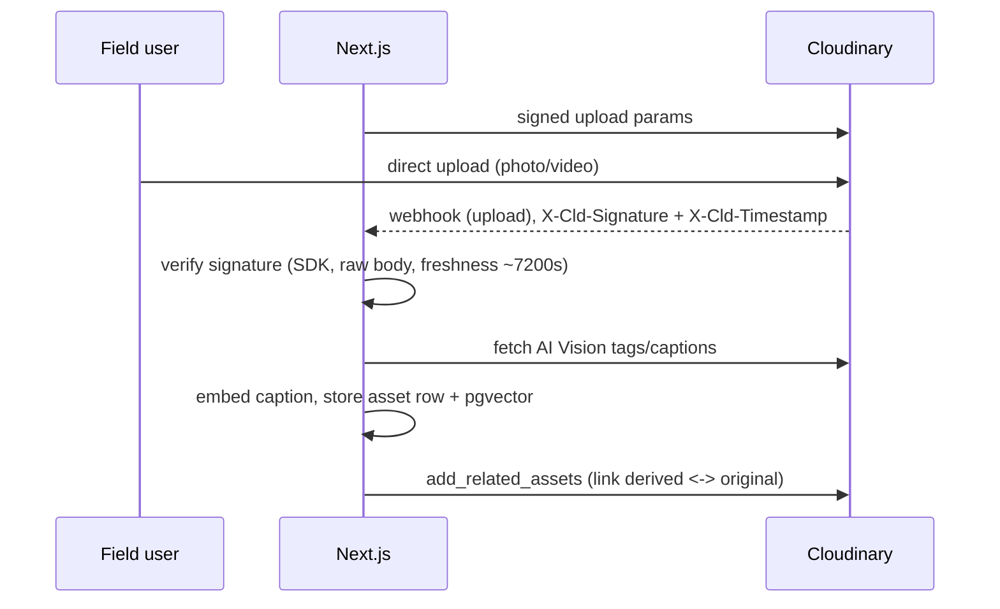
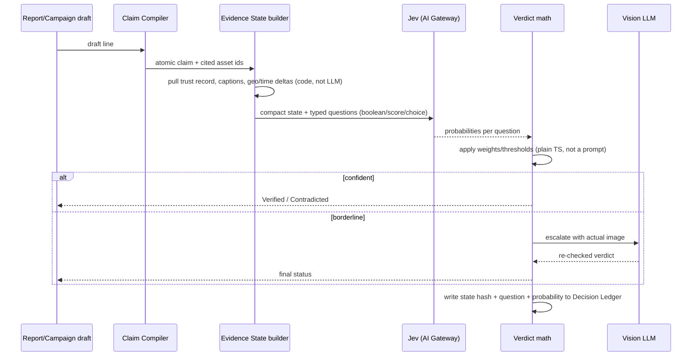

# Pramaan — Master Spec (single-file AGENTS.md)

This one file is the complete spec for Pramaan — a Geek Room × Cloudinary hackathon project (Problem Statement 02: AI-Powered Impact & Sustainability Media Platform; online round 3 Oct 2026, offline round 11 Oct 2026). Keep it named `AGENTS.md` at the repo root — Antigravity (v1.20.3+), Cursor, and Claude Code all auto-load a root `AGENTS.md` before starting a task, so nothing else needs to be pasted in separately.

**Before writing any code:**
1. Read this whole file once.
2. Check §6 Build Phases for the currently active phase and its demo checkpoint. Work inside that phase's scope only — don't jump ahead.
3. Follow §5 Rules without exception. If a task seems to need breaking a rule, stop and ask instead of working around it.
4. If `.env.local` is missing a required key (Cloudinary, Supabase, AI Gateway), stop and ask for it rather than inventing a placeholder that looks real.
5. After finishing a phase's checkpoint, create or update `Memory.md` at the repo root with what's done, what's next, and anything a fresh session would need — so a new chat doesn't have to re-read the whole codebase.

---

## 1. Product Requirements

**Event:** Geek Room × Cloudinary, Problem Statement 02 · Online round 3 Oct 2026 · Offline round 11 Oct 2026
**One-line:** Pramaan turns raw field photos/video from NGOs, governments and sustainability orgs into searchable, quantified, and cited evidence of impact.

### Problem (in our words)
Field teams generate large volumes of photos and videos from projects, environmental work and community programs. Manually organizing, verifying, and turning that media into credible reports or "proof of impact" doesn't scale — and donors, the public, and journalists increasingly question whether impact claims are actually backed by evidence rather than reused or misleading photos.

### Users & personas
- **M&E / Program officer** (primary) — compiles reports on a deadline, needs defensible evidence fast, not folders of photos.
- **Field staff / volunteer** — uploads media from a site visit with minimal training.
- **Donor / CSR reviewer / public** — scans a QR code on a report and wants to independently check a claim.
- **Hackathon judge** — a persona worth designing for: needs to grasp the differentiation in under 3 minutes.

### Goals
1. Ingest large photo/video batches with rich, automatically captured context (project, location, time, quality).
2. Make media searchable in natural language, not folder browsing.
3. Quantify before/after change instead of asking people to "trust the caption."
4. Attach a verifiable trust signal to every *claim*, not just to every asset.
5. Generate reports and campaign content that only say what the evidence actually supports.
6. Preserve a traceable, tamper-evident chain from a claim back to its source asset.

### Non-goals (v1)
- Not a satellite/remote-sensing platform.
- Not a legal or forensic authentication tool — "tamper-evident," never "unhackable proof."
- No outbreak/impact forecasting — verification of evidence only.

### Feature list (tiered)

#### Must — Tier 1, required by 3 Oct
| # | Feature | User story |
|---|---|---|
| 1 | Smart Ingest | Field officer uploads photos/videos tagged to a project/activity/location, so nothing gets lost in a folder |
| 2 | AI Tagging | Every asset is auto-tagged and captioned — no manual labelling |
| 3 | Semantic Search | "Plantation near a river after monsoon" returns matching media, not folders |
| 4 | Before/After Studio | Paired before/after shots of the same site show whether anything actually changed |
| 5 | Evidence Receipts + Report | A PDF where every claim links to an asset "receipt" with metadata |

#### Should — Tier 2, target for 3 Oct, hardened through 11 Oct
| # | Feature | User story |
|---|---|---|
| 6 | Change Score | A number/heatmap for "how much changed," not just a slider |
| 7 | Trust Layer / Survival Score | Flags a reused, out-of-geofence, or otherwise suspicious photo before anyone believes it |
| 8 | Jev Jury (verdict engine) | Every claim is cross-examined against evidence before it enters a report |
| 9 | Cited Copilot | A question gets an answer with clickable evidence, or "no evidence found" |
| 10 | Campaign Studio | Social-ready assets generated from verified evidence in one click |

#### Could — Tier 3, offline-round stretch, 4–10 Oct
| # | Feature |
|---|---|
| 11 | Video Moments — searchable video timestamps |
| 12 | Privacy Guard — auto face-blur on public assets |
| 13 | Field capture bot / offline-first PWA |
| 14 | Geo-timeline map |
| 15 | Decision ledger + evidence-ablation explanations |

### Success metrics (for the demo)
- Upload → tagged → searchable in under a minute (excluding heavy video).
- Claim verification precision/recall measured on our own labeled set of 40–60 claims (half deliberately false) — a real number, not a vendor benchmark.
- Duplicate/reuse detection catches a re-uploaded judge photo live, on stage.
- A judge who scans a report's QR sees the same verdict Pramaan showed on screen.

### Assumptions & open risks
- Cloudinary AI Vision/captioning add-ons need to be confirmed enabled on the hackathon account — verify Day 0.
- Jev (TypeSafe AI, via Vercel AI Gateway) pricing/availability may change after the 25 Sep promo window — keep an LLM-based fallback evaluator ready.
- Team size isn't fixed yet — §6 Build Phases is written as functional workstreams so it scales from one person to several.

### Milestones
| Date | Milestone |
|---|---|
| 25 Sep | Accounts + keys live, dataset capture starts |
| 28 Sep | Ingest → enrich → search working |
| 30 Sep | Trust Layer + Jev Jury + receipts working |
| 2 Oct | Campaign Studio + Copilot done, deployed, backup demo video recorded |
| 3 Oct | Online round submission |
| 10 Oct | Stretch features done, pitch rehearsed |
| 11 Oct | Offline round |

---

## 2. Architecture

### High-level flow


### Stack
| Layer | Choice | Why |
|---|---|---|
| Frontend | Next.js (App Router) + TypeScript + Tailwind + shadcn/ui | Fast to ship, server components for data-heavy pages |
| Media | Cloudinary — upload, AI Vision/captioning, generative transforms, related assets, webhooks | Sponsor requirement, and does perception + campaign rendering in one place |
| Verdict engine | Jev via Vercel AI Gateway (`experimental_evaluate`) | Fast, parallel, *typed* verification — not free-text generation |
| Escalation LLM | Any vision-capable model via the same AI SDK | Handles the slice of claims Jev calls "borderline" |
| Database | Supabase Postgres + pgvector | Embeddings and relational data in one place, with Row Level Security |
| Auth | Supabase Auth | Email/password is enough for a hackathon demo |
| Image math | `sharp` (Node) | ExG vegetation index and other quick pixel-level checks |
| Hosting | Vercel | Same platform as the AI Gateway, zero extra config |

> Confirm the exact Jev model slug (`typesafe-ai/jev` vs. `typesafe-ai/jev-latest`) with a live test call in Phase 0 — sources disagree and this shouldn't be discovered mid-build.

> The public marketing page (`(marketing)/` below) intentionally skips shadcn's default Inter font and Lucide icons — swap in the Fraunces/IBM Plex/custom-SVG choices from §4 Design System → Public Marketing Site when scaffolding its components, not the shadcn defaults used in `(dashboard)/`.

### Folder structure
```
pramaan/
├─ app/
│  ├─ (marketing)/
│  │  ├─ page.tsx                      # public landing page — §4 Design System → Public Marketing Site
│  │  ├─ terms/page.tsx                # draft, see §4 Design System
│  │  └─ privacy/page.tsx              # draft, see §4 Design System
│  ├─ (dashboard)/
│  │  ├─ projects/[id]/page.tsx        # asset gallery for a project
│  │  ├─ search/page.tsx               # semantic search
│  │  ├─ before-after/[pairId]/page.tsx
│  │  ├─ copilot/page.tsx              # cited chat
│  │  └─ campaign/[claimId]/page.tsx
│  ├─ verify/[assetId]/page.tsx        # public, no auth — QR target
│  ├─ api/
│  │  ├─ upload-signature/route.ts
│  │  ├─ webhooks/cloudinary/route.ts
│  │  ├─ enrich/route.ts               # tagging + embeddings
│  │  ├─ pair/route.ts                 # before/after matching
│  │  ├─ claims/compile/route.ts
│  │  ├─ claims/verify/route.ts        # calls Jev
│  │  └─ report/route.ts               # PDF generation
│  └─ layout.tsx
├─ lib/
│  ├─ cloudinary.ts                    # signed upload, related assets, transforms
│  ├─ jev.ts                           # evaluate() wrapper + verdict math
│  ├─ trust.ts                         # deterministic checks (geofence, pHash, EXIF)
│  ├─ change-score.ts                  # ExG + LLM structured diff
│  ├─ embeddings.ts
│  └─ db.ts                            # Supabase client
├─ supabase/migrations/                # schema — see §3 System Design → Data model
├─ AGENTS.md                           # this file — the complete spec, auto-loaded by Antigravity/Cursor/Claude Code
└─ Memory.md                           # added once coding starts — see §5 Rules
```
The standalone `PRD.md` / `Architecture.md` / `Rules.md` / `Phases.md` / `Design.md` / `System-Design.md` files, if you keep them in the repo too, are just per-topic copies of the sections below for easier reading — this file is the source of truth; edit it first and copy changes across if you keep both.

### API routes
| Route | Purpose |
|---|---|
| `POST /api/upload-signature` | Returns a signed Cloudinary upload payload scoped to a project |
| `POST /api/webhooks/cloudinary` | Verifies the notification signature, enqueues enrichment |
| `POST /api/enrich` | AI Vision tagging/captioning, embeds caption, stores metadata |
| `POST /api/pair` | Candidate before/after pairs by geo-radius + embedding similarity |
| `POST /api/claims/compile` | Splits a draft report/campaign line into atomic typed claims |
| `POST /api/claims/verify` | Sends claim + Evidence State to Jev, applies verdict math, escalates borderline |
| `GET /verify/:assetId` | Public page: asset + trust badge + transformation chain, no login |

Full request/response contracts and auth requirements are in §3 System Design → API contract.

### Environment variables
```
CLOUDINARY_CLOUD_NAME=
CLOUDINARY_API_KEY=
CLOUDINARY_API_SECRET=
CLOUDINARY_SIGNATURE_ALGORITHM=sha256      # opt-in; confirm account setting first, SDK default is sha1
AI_GATEWAY_API_KEY=                        # or Vercel OIDC if hosted on Vercel
SUPABASE_URL=
SUPABASE_SERVICE_ROLE_KEY=
ESCALATION_MODEL=                          # vision LLM fallback for Jev + for outage
```

---

## 3. System Design (HLD)

### Component overview


### Data model (core entities)


### Sequence: ingest → enrichment

The webhook signature check must run before the body is parsed for anything else, and must hash the **raw** request bytes — Cloudinary's signature is `SHA(raw_body + timestamp + api_secret)`, a plain hash, not a keyed HMAC, so re-serializing the JSON before checking breaks verification. Retries arrive up to 3 times (roughly 3/6/9 minutes) if we don't return 200, so returning `401` on a bad signature is safe and expected — Cloudinary won't disable the endpoint for it.

### Sequence: claim verification (Jev Jury)


### API contract (summary)
| Endpoint | Method | Auth | Purpose |
|---|---|---|---|
| `/api/upload-signature` | POST | session | Scoped signed upload params |
| `/api/webhooks/cloudinary` | POST | signature header | Ingest notification |
| `/api/enrich` | POST | internal | Tagging + embedding |
| `/api/pair` | POST | session | Before/after candidate generation |
| `/api/claims/compile` | POST | session | Draft text → atomic claims |
| `/api/claims/verify` | POST | session | Runs Jev Jury, returns verdict |
| `/api/report` | POST | session | PDF generation |
| `/verify/:assetId` | GET | none | Public QR-target page |

### Security & integrity
- **Originals stay `authenticated` delivery type**; only derived/public versions are `upload`/public — keeps a private master copy of every asset.
- **Webhook signature verification is mandatory**, not optional (see "Sequence: ingest → enrichment" above). Confirm `signature_algorithm` against the account — the SDK default is SHA-1, SHA-256 is opt-in.
- **Traceability is two-layered:** our own `LEDGER_ENTRY` rows, plus Cloudinary's own `add_related_assets` linking every derived/transformed asset back to its original (up to 10 related assets per call, bidirectional) — so the chain is verifiable inside Cloudinary's own library too, not only in our database.
- **Row Level Security** in Supabase: a field user can insert assets into their own project only; verdicts and ledger entries are insert-only from server routes, never client-writable.
- **Duplicate/reuse detection** via `phash` distance is a similarity signal, not proof — labeled that way in the UI (see §4 Design System → States).

### Scaling notes (stated honestly, for a hackathon-scale system)
- pgvector is fine up to tens of thousands of assets; at real production scale, embeddings would move to a dedicated vector store — out of scope here.
- Jev's per-question calls run in parallel already, so the number of questions per claim barely affects latency — the real cost lever is claim *volume*, controlled by the cascade (Jev on everything, the vision LLM only on the borderline slice).
- Video processing (keyframing, transcripts) is the one component worth queuing as a background job rather than running inline in a webhook handler, given typical serverless timeout limits.

### Known limitations (say these on stage before a judge finds them)
- EXIF/GPS can be spoofed — the Trust Layer is described as tamper-evident, not tamper-proof.
- Jev's probabilities are only as calibrated as the labeled-set evaluation actually run before submission — quote that number, not a vendor benchmark.
- Cloudinary's premium Visual Search (Assets) feature requires Enterprise and per-asset opt-in at upload time — semantic search here is built on our own pgvector embeddings so it doesn't depend on that being enabled.

---

## 4. Design System

### Grounding
Pramaan is an evidence/verification tool for NGO program officers, field staff, and donors — not a consumer app. The visual language should read like a **field ledger crossed with an official verification stamp**: something that belongs in a dossier of evidence, not a marketing SaaS product. Every trust state (verified / needs review / contradicted) should look and feel like an ink stamp, because that's the mental model the whole product is built on.

### Color
| Token | Hex | Role |
|---|---|---|
| `ink` | `#1F2A24` | Primary text, dark surfaces — deep forestry-ink green-black, not flat black |
| `paper` | `#EDE6D6` | Base background — aged ledger paper |
| `moss` | `#3F6B4F` | Verified state, primary accent, headers |
| `ochre` | `#C68A2E` | Needs-review / flagged state — turmeric-stamp tone |
| `oxide` | `#9E3B34` | Contradicted / rejected state — old rubber-stamp red |
| `slate` | `#6B7268` | Borders, secondary text, dividers |

Deliberately not the warm-cream-plus-terracotta or near-black-plus-neon pairings that read as generated-by-default — this leans into paper/stamp/ledger material instead of a generic light or dark SaaS theme.

### Type
| Role | Face | Why |
|---|---|---|
| Display / headings | Fraunces (serif, soft optical sizing) | Slightly irregular at large sizes — reads as stamped/printed, not corporate |
| Body / UI | IBM Plex Sans | Technical-but-humanist register, fits a governmental/NGO evidence tool |
| Data / receipts / hashes | IBM Plex Mono | Asset IDs, hashes, timestamps only — never prose |

Two clearly distinct families (serif display, sans body) plus one monospace reserved strictly for data.

### Layout
Left-aligned, document-column layouts throughout — this is a dossier, not a centered landing page.

```
Gallery (contact-sheet, not card-grid):
┌───────────┬───────────┬───────────┐
│  photo    │  photo    │  photo    │
├───────────┼───────────┼───────────┤
│ Site A · 12 Aug · [●moss] 0.92    │  ← ledger line, not a caption chip
├───────────┼───────────┼───────────┤
│  photo    │  photo    │  photo    │
└───────────┴───────────┴───────────┘

Claim Card (stamped voucher, not a rounded SaaS card):
┌──────────────────────────────┐
╱                                ╲   ← torn/perforated top edge (SVG)
│  "Plantation drive, Site A"    │
│  ─────────────────────────    │
│  activity shown      ✓ 0.94   │
│  wrong environment    ✗ 0.03  │
│  scale contradicts    ✗ 0.06  │
│                         [MOSS │
│                        STAMP, │
│                       rotated │
│                         -6°]  │
│  a1b2…f9  ·  02:14:09         │  ← mono footer: state hash + time
└──────────────────────────────┘
```

### Principles
1. **Stamps, not badges.** Verified/Review/Rejected render as a rotated ink-stamp graphic (SVG, `moss`/`ochre`/`oxide`), not a rounded pill — this is the one bold element per screen.
2. **Numbering only where it's real.** The transformation chain on a Verify page is genuinely sequential, so it's the one place using numbered steps; nowhere else.
3. **One motion moment.** When a claim resolves, the stamp animates down once (scale + slight rotate, ~200ms) — no hover animation on every card, no page-load fade cascade.
4. **Density is a feature.** This is a professional evidence tool — ledger lines, mono data, and visible metadata are correct, not clutter to hide behind whitespace.
5. **Public pages stay legible without color.** The Verify page (judges/donors scanning a QR) must read in grayscale — stamps always carry a text label (`VERIFIED` / `REVIEW` / `CONTRADICTED`), never color alone.

### States
| State | Color | Label |
|---|---|---|
| Verified | `moss` | "VERIFIED" |
| Needs review | `ochre` | "REVIEW" |
| Contradicted | `oxide` | "CONTRADICTED" |
| Processing | `slate`, no stamp yet | "PROCESSING" |

### Public Marketing Site (separate from the dashboard above)
Everything above governs the operational tool — gallery, search, claim cards, verify page — that program officers and field staff use daily. The public marketing site does a different job: a small set of pages that explain Pramaan to someone seeing it for the first time (donors, partners, judges), in the restrained, product-first register of Apple's marketing pages rather than the ledger/stamp density of the app itself. Same brand, quieter register — not a second identity.

#### Brief
| Field | Answer |
|---|---|
| Product | Pramaan — turns NGO and sustainability field photos/video into searchable, quantified evidence; every claim in a report is checked against the actual media before it's allowed to publish |
| Audience | NGO program officers and M&E leads, CSR/donor reviewers, and hackathon judges seeing it for the first time |
| Main action | Watch a real claim get verified, end to end — there's no signup flow at MVP stage, so the CTA is "see it work," not "create an account" |
| Real content needed | One real before/after pair, one real Claim Card with an actual Jev verdict, a 60–90s screen recording. **None of this exists yet** — capture it early before this page ships; don't fill the hero with a placeholder |
| Pages this version needs | One scrollable home page (hero, problem, how it works, live demo embed, hackathon footer) + Terms and Privacy stub pages |
| Existing stack | Same Next.js/TS/Tailwind repo as the dashboard — see §2 Architecture → Folder structure |
| Reference | None supplied — the brief's own "Apple marketing restraint" description is the reference |

#### Design direction
Reuses two of the three dashboard tokens rather than inventing a second palette, so the brand reads as one thing at two volumes:
| Token | Hex | Role here |
|---|---|---|
| `ink` | `#1F2A24` | Text |
| `paper-light` | `#F6F2EA` | Background — warmer and lighter than the dashboard's `paper`, still not pure white |
| `moss` | `#3F6B4F` | The one restrained accent — reusing "verified green" as the public brand color is deliberate, not incidental |

Type stays identical to the dashboard system above — Fraunces for display, IBM Plex Sans for body, IBM Plex Mono for any data shown (a real verdict snippet, a hash). None of Inter, Geist, or Space Grotesk were ever in the system, so this constraint was already satisfied before it was asked for.

Icons: no Lucide. The brand's whole vocabulary is already the ink stamp — build the handful of icons this page actually needs (play, external link) as small custom SVG marks in the same line weight as the stamp graphic, rather than pulling in a second icon system.

#### Layout — vary each section to what it explains
```
Hero        — headline, one-line description, CTA, real product screenshot
              (a Claim Card or the Verify page) as the dominant visual, left-aligned
Problem     — short paragraph, no stat cards (no real numbers exist yet)
How it      — three stages, three different treatments, not three matching cards:
 works        1. Perceive  — wide image+text row (an actual tagged asset)
              2. Verify    — a real (or clearly labeled simulated) Jev verdict,
                             shown as mono-font data, not an icon
              3. Publish   — a screenshot of a generated receipt/report
Demo        — the real screen recording, or a link to a live Verify page
Footer      — hackathon context, dates, GitHub/submission link, Terms/Privacy
```

#### Content rules
- No invented testimonials, logos, customers, or stats — accurate anyway, since there are no users yet.
- No em dashes, en dashes, or an "it's not X, it's Y" copy formula — state the benefit directly.
- Any simulated result (a verdict shown before the real pipeline is wired up) is labeled "Simulated example" in the UI itself, not just known internally.

#### Behavior
- One motion moment only, same principle as the dashboard — no per-card hover animation.
- Respect `prefers-reduced-motion`; normal scroll behavior throughout.
- Keyboard focus stays visible; there are no real forms on this page at MVP (no signup exists yet), so this mainly covers the nav and the demo player's controls.

#### Terms and Privacy — draft status
Pramaan has no real legal or data-handling commitments yet — this is a hackathon prototype, not a live product with real accounts. Both pages should say so plainly and be marked **DRAFT — for review before any real user data is collected**, stating only what's actually true today (media stored via Cloudinary, metadata via Supabase, no account system yet) rather than inventing policy language.

#### Build workflow for this page specifically
Inspect the existing repo and this design system before writing anything new; reuse the `ink`/`moss`/type tokens rather than re-deriving them. Build the hero section first with the real screenshot once it exists, check it at desktop and mobile widths, then extend to the rest of the page. Report what was actually tested (which widths, which browsers) and what's still unfinished — don't report a page as checked if it wasn't actually run.

---

## 5. Rules for AI-assisted Coding

### Use
- TypeScript everywhere, `strict: true`. No `any` without a `// TODO(reason)` comment.
- Validate every external input (webhook body, form data, Jev response) with `zod` before touching it.
- Cloudinary Node SDK for all Cloudinary calls — no hand-rolled signing.
- Keep verdict math (thresholds, weighting, escalation rules) in plain TypeScript functions, never inside an LLM prompt. Jev/LLM outputs are *inputs* to that math, not the decision itself.
- Server-only secrets (`CLOUDINARY_API_SECRET`, `AI_GATEWAY_API_KEY`, `SUPABASE_SERVICE_ROLE_KEY`) are only read in `app/api/**` or `lib/**` server code — never in a client component, never in a `NEXT_PUBLIC_*` variable.

### Avoid
- Don't add a new state-management library (Redux/Zustand/etc.) — React state plus server components is enough at this scale.
- Don't call the Cloudinary Admin API from the client. All Admin API calls go through our own API routes.
- Don't hand-roll session/JWT logic — use Supabase Auth as-is.
- Don't introduce a second vector store (Pinecone/Weaviate/etc.) — pgvector is already inside Postgres; one less service to keep alive during a demo.

### Error handling
- **Fail closed on trust, not on features.** If Cloudinary enrichment fails, still show the asset — just without tags/trust badge, marked "processing." If Jev or the escalation LLM errors, the claim's status is `needs_review`, never silently `verified`.
- Every API route returns `{ ok: boolean, error?: string }` on failure paths — no bare 500s with stack traces reaching the client.
- Webhook route: verify signature and timestamp *before* touching the body; on failure return 401, not 200 (a fake 200 would stop Cloudinary's retries from ever reaching a fixed endpoint).
- Log every verdict's inputs/outputs (state hash, question, probability) even on the happy path — this is the Decision Ledger, not optional debug output.

### Working with Jev specifically
- One compact state object per call — a few hundred tokens at most, built in `lib/trust.ts`. Never send raw EXIF blobs or full asset records.
- Never let Jev's probability alone flip a claim to "Verified" — always route it through the weighting/threshold function in `lib/jev.ts`.
- Cache verdicts by `(claim_hash, evidence_state_hash)` — don't re-call Jev for an unchanged claim.

### Working on existing code
- Inspect the current implementation before changing it — read the relevant file(s) first, don't guess at what's already there.
- Preserve working features; use the simplest implementation that satisfies the brief, not the most impressive one.
- Report exactly what was tested (which viewport widths, which flow) and what remains unfinished. Never describe a page or flow as checked if it wasn't actually run.

### Ask before doing
- Adding any npm dependency not already listed in §2 Architecture → Stack.
- Changing the verdict math's thresholds (these should come from the labeled-set evaluation in §1 Product Requirements → Success metrics, not a guess).
- Removing or weakening a Trust Layer check, even "temporarily for the demo."

### Git
- Branch per phase: `phase-1-ingest`, `phase-2-search`, etc. — matches §6 Build Phases.
- Commit messages: `phase:` prefix, imperative mood — e.g. `phase-3: add before/after geo-radius pairing`.
- `.env.local` is gitignored; commit `.env.example` with empty values instead.

---

## 6. Build Phases

Each phase should be independently demoable — if time runs out, stopping after any phase still leaves something coherent to show. Written as functional workstreams rather than named roles, so it scales whether it's one person or several.

### Phase 0 — Setup (25 Sep)
- Cloudinary: enable AI Vision/captioning add-on, confirm `visual_search` and `signature_algorithm` account settings.
- Supabase: enable `pgvector`, create base schema (§3 System Design → Data model).
- Vercel AI Gateway key; one test call to Jev to confirm the working model slug.
- Capture or source the demo dataset — 2–3 project sites × 6–10 before/after pairs + 2 short videos, real GPS/timestamps.
- **Demo checkpoint:** none yet — infra only.

### Phase 1 — Smart Ingest (26–27 Sep)
- Signed upload widget scoped to a project/activity.
- Webhook receiver with signature verification.
- Store EXIF/GPS/timestamp/quality/pHash per asset.
- **Demo checkpoint:** upload a photo, see it appear with its metadata.

### Phase 2 — AI Tagging + Semantic Search (27–28 Sep)
- Call Cloudinary AI Vision for captions/tags on webhook.
- Embed captions, store in pgvector.
- Search UI: natural-language query + project/geo/date filters.
- **Demo checkpoint:** type a query, get relevant matching assets back.

### Phase 3 — Before/After Studio (29 Sep)
- Candidate pairing: same-project assets within a GPS radius, ranked by embedding similarity.
- Slider UI; time-lapse stitch for 3+ shots of a site.
- Change Score v1 (ExG for vegetation cases).
- **Demo checkpoint:** pick a site, see a before/after slider and a change number.

### Phase 4 — Trust Layer + Jev Jury (29–30 Sep)
- Deterministic checks: geofence, timestamp sanity, blur, pHash duplicate/reuse detection.
- Evidence State builder (compact JSON per asset/claim).
- Claim compiler: split a draft line into atomic typed claims.
- Jev integration: boolean/score/choice questions, verdict math, escalation to the vision LLM on borderline.
- Decision ledger (state hash + question + probability, stored).
- **Demo checkpoint:** feed a true and a false claim, see different verdicts live.

### Phase 5 — Reports + Receipts + Verify page (30 Sep – 1 Oct)
- PDF report generator, SDG-mapped, one "receipt" section per asset.
- Public `/verify/:assetId` page (QR target): asset + trust badge + transformation chain.
- **Demo checkpoint:** generate a report, scan its QR, land on a matching verify page.

### Phase 6 — Cited Copilot (1 Oct)
- Chat UI restricted to verified claims only; "no evidence found" when nothing qualifies.
- Clickable citations linking back to receipts.
- **Demo checkpoint:** ask a question live, get a cited answer.

### Phase 7 — Campaign Studio (1–2 Oct)
- One-click generation: IG carousel, 9:16 story, LinkedIn banner, short reel.
- Cloudinary generative fill/background-replace + smart crop + verified-badge QR overlay + bilingual caption.
- **Demo checkpoint:** turn a verified claim into a postable asset.

### Phase 8 — Submission hardening (2 Oct)
- Deploy, record a 2-minute backup demo video, write the README.
- Run the labeled-set evaluation (40–60 claims) for real precision/recall numbers.
- Public landing page (§4 Design System → Public Marketing Site) if time allows — a good async-reviewable front door for judges, but never at the cost of the working demo itself. Slides to Phase 9 if it doesn't fit.
- Submit for the 3 Oct online round.

### Phase 9 — Offline-round stretch (4–10 Oct)
- Video Moments (keyframe extraction + timestamped search).
- Privacy Guard (auto face-blur on public/campaign assets).
- Field capture bot or offline-first PWA — pick one.
- Geo-timeline map.
- Evidence-ablation explanations for the Decision Ledger.
- Pitch rehearsal, including the live "upload a judge's photo twice" duplicate-detection moment.

---

## 7. Memory (added once coding starts)
`Memory.md` doesn't exist at the start of the project. Create it the first time a phase checkpoint is reached, and keep it updated after every session: what's built, what's currently broken, what the next task is, and any decision made that isn't already captured above. This is what lets a new chat session pick up mid-build without re-reading the whole codebase.

<!-- BEGIN:nextjs-agent-rules -->

# This is NOT the Next.js you know

This version has breaking changes — APIs, conventions, and file structure may all differ from your training data. Read the relevant guide in `node_modules/next/dist/docs/` (resolved from this file's directory; in monorepos the `next` package may not be visible from the repo root) before writing any code. Heed deprecation notices.

This block is written and re-added by `next dev` — verify at `node_modules/next/dist/server/lib/generate-agent-files.js`. Removing it from a diff only re-creates the uncommitted change; committing it with your work keeps the tree clean.

<!-- END:nextjs-agent-rules -->
