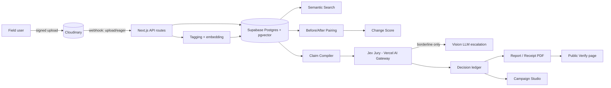

# Pramaan — Architecture

## 1. High-level flow


## 2. Stack
| Layer | Choice | Why |
|---|---|---|
| Frontend | Next.js (App Router) + TypeScript + Tailwind + shadcn/ui | Fast to ship, server components for data-heavy pages |
| Media | Cloudinary — upload, AI Vision/captioning, generative transforms, related assets, webhooks | Sponsor requirement, and does perception + campaign rendering in one place |
| Verdict engine | Jev via Vercel AI Gateway (`experimental_evaluate`) | Fast, parallel, *typed* verification — not free-text generation |
| Escalation LLM | Any vision-capable model via the same AI SDK | Handles the slice of claims Jev calls "borderline" |
| Database | Supabase Postgres + pgvector | Embeddings and relational data in one place, with Row Level Security |
| Auth | Supabase Auth | Email/password is enough for a hackathon demo |
| Image math | `sharp` (Node) | ExG vegetation index and other quick pixel-level checks |
| Hosting | Vercel | Same platform as the AI Gateway, zero extra config |

> Confirm the exact Jev model slug (`typesafe-ai/jev` vs. `typesafe-ai/jev-latest`) with a live test call in Phase 0 — sources disagree and this shouldn't be discovered mid-build.

> The public marketing page (`(marketing)/` below) intentionally skips shadcn's default Inter font and Lucide icons — swap in the Fraunces/IBM Plex/custom-SVG choices from `Design.md` → Public Marketing Site when scaffolding its components, not the shadcn defaults used in `(dashboard)/`.

## 3. Folder structure
```
pramaan/
├─ app/
│  ├─ (marketing)/
│  │  ├─ page.tsx                      # public landing page — Design.md → Public Marketing Site
│  │  ├─ terms/page.tsx                # draft, see Design.md
│  │  └─ privacy/page.tsx              # draft, see Design.md
│  ├─ (dashboard)/
│  │  ├─ projects/[id]/page.tsx        # asset gallery for a project
│  │  ├─ search/page.tsx               # semantic search
│  │  ├─ before-after/[pairId]/page.tsx
│  │  ├─ copilot/page.tsx              # cited chat
│  │  └─ campaign/[claimId]/page.tsx
│  ├─ verify/[assetId]/page.tsx        # public, no auth — QR target
│  ├─ api/
│  │  ├─ upload-signature/route.ts
│  │  ├─ webhooks/cloudinary/route.ts
│  │  ├─ enrich/route.ts               # tagging + embeddings
│  │  ├─ pair/route.ts                 # before/after matching
│  │  ├─ claims/compile/route.ts
│  │  ├─ claims/verify/route.ts        # calls Jev
│  │  └─ report/route.ts               # PDF generation
│  └─ layout.tsx
├─ lib/
│  ├─ cloudinary.ts                    # signed upload, related assets, transforms
│  ├─ jev.ts                           # evaluate() wrapper + verdict math
│  ├─ trust.ts                         # deterministic checks (geofence, pHash, EXIF)
│  ├─ change-score.ts                  # ExG + LLM structured diff
│  ├─ embeddings.ts
│  └─ db.ts                            # Supabase client
├─ supabase/migrations/                # schema — see System-Design.md §2
├─ PRD.md · Architecture.md · Rules.md · Phases.md · Design.md · System-Design.md
├─ AGENTS.md                           # tells Antigravity/Cursor/Claude Code to read the above first
└─ Memory.md                           # added once coding starts — see Rules.md
```

## 4. API routes
| Route | Purpose |
|---|---|
| `POST /api/upload-signature` | Returns a signed Cloudinary upload payload scoped to a project |
| `POST /api/webhooks/cloudinary` | Verifies the notification signature, enqueues enrichment |
| `POST /api/enrich` | AI Vision tagging/captioning, embeds caption, stores metadata |
| `POST /api/pair` | Candidate before/after pairs by geo-radius + embedding similarity |
| `POST /api/claims/compile` | Splits a draft report/campaign line into atomic typed claims |
| `POST /api/claims/verify` | Sends claim + Evidence State to Jev, applies verdict math, escalates borderline |
| `GET /verify/:assetId` | Public page: asset + trust badge + transformation chain, no login |

Full request/response contracts and auth requirements are in `System-Design.md` §5.

## 5. Environment variables
```
CLOUDINARY_CLOUD_NAME=
CLOUDINARY_API_KEY=
CLOUDINARY_API_SECRET=
CLOUDINARY_SIGNATURE_ALGORITHM=sha256      # opt-in; confirm account setting first, SDK default is sha1
AI_GATEWAY_API_KEY=                        # or Vercel OIDC if hosted on Vercel
SUPABASE_URL=
SUPABASE_SERVICE_ROLE_KEY=
ESCALATION_MODEL=                          # vision LLM fallback for Jev + for outage
```
