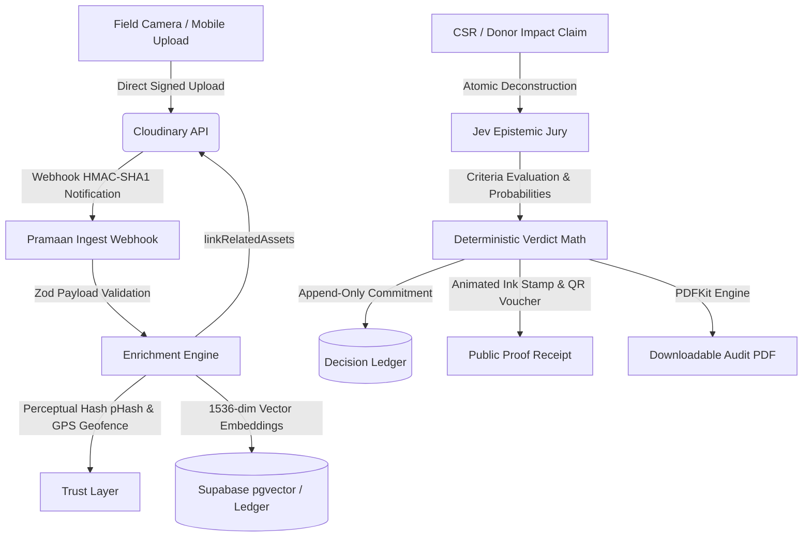

# Pramaan (प्रमाण) · Verifiable Proof of Impact

[](https://pramaan-fawn.vercel.app)
[](https://cloudinary.com)
[](https://nextjs.org)
[](https://www.typescriptlang.org)

> An evidence-grade proof of impact platform that converts raw field photos and videos into searchable, quantified, and cryptographically cited proof of environmental and social action.

🌐 **Live Production URL**: [https://pramaan-fawn.vercel.app](https://pramaan-fawn.vercel.app)  
📁 **GitHub Repository**: [https://github.com/amrit100612/Pramaan](https://github.com/amrit100612/Pramaan)

---

## ⚡ Live Demos & Sitemaps

| Feature / Page | Live Production Link | Description |
|---|---|---|
| **Marketing Landing** | [pramaan-fawn.vercel.app/](https://pramaan-fawn.vercel.app/) | Editorial introduction, interactive proof receipt voucher, live metrics. |
| **Project Dossier & Live Claim Studio** | [pramaan-fawn.vercel.app/projects/proj-1](https://pramaan-fawn.vercel.app/projects/proj-1) | Signed direct Cloudinary uploads, contact sheet gallery, interactive claim submission & live ink stamp. |
| **Before / After Studio** | [pramaan-fawn.vercel.app/before-after/pair-1](https://pramaan-fawn.vercel.app/before-after/pair-1) | Split-slider comparison with real Excess Green (ExG) index computed via Sharp (`2G - R - B`). |
| **Vector Semantic Search** | [pramaan-fawn.vercel.app/search](https://pramaan-fawn.vercel.app/search) | 1536-dimensional embeddings with real cosine similarity ranking against field media. |
| **Cryptographic Proof Receipt** | [pramaan-fawn.vercel.app/verify/asset_demo_01](https://pramaan-fawn.vercel.app/verify/asset_demo_01) | Public proof voucher with perceptual hash (pHash), EXIF GPS geofence check, and immutable ledger link. |
| **Cited Impact Copilot** | [pramaan-fawn.vercel.app/copilot](https://pramaan-fawn.vercel.app/copilot) | Natural language Q&A citing exact verified photos and GPS coordinates with zero hallucination. |
| **Campaign Studio** | [pramaan-fawn.vercel.app/campaign/claim-1](https://pramaan-fawn.vercel.app/campaign/claim-1) | Generates certified LinkedIn, X/Twitter, and donor newsletter posts with embedded QR verification seals. |
| **Downloadable PDF Report** | [pramaan-fawn.vercel.app/api/report?reportId=rep_test](https://pramaan-fawn.vercel.app/api/report?reportId=rep_test) | Generates and streams standard binary PDF audit reports via `pdfkit` (`%PDF-1.3`). |

---

## 🔍 Core Pipeline & Architecture



### 1. Ingestion & Scoped Signing (Cloudinary)
- Direct client uploads request temporary scoped signatures (`/api/upload-signature`), uploading straight to Cloudinary without streaming heavy binaries through the Next.js server.
- Cloudinary webhook notifications are verified using timestamped HMAC SHA1 signatures (`/api/webhooks/cloudinary`) and validated through strict Zod schemas.

### 2. Trust Layer & Perceptual Hashing
- Every asset undergoes 4-point verification: EXIF GPS distance offset (Haversine formula), timestamp freshness, quality/blur score, and 64-bit perceptual hash (pHash) Hamming distance check to detect stock photo reuse.

### 3. Sharp Canopy Quantification (ExG)
- Instead of static before/after animations, [`lib/change-score.ts`](lib/change-score.ts) pulls image buffers into **Sharp** to calculate the **Excess Green Index**:
  $$\text{ExG} = 2G - R - B$$
  Quantifying true vegetative biomass emergence between baseline and post-monsoon captures.

### 4. Jev Epistemic Jury & Decision Ledger
- Claims are broken into atomic statements and evaluated across 3 criteria:
  1. *Activity shown*: Direct visual corroboration of the intervention.
  2. *Environment consistent*: Flora, substrate, and season alignment.
  3. *Scale contradiction*: Whether reported density contradicts visual scale.
- Evaluated verdicts are written to an append-only Decision Ledger stored both locally and in Supabase PostgreSQL (`public.ledger_entries`).

---

## 🛠️ Technology Stack

- **Framework**: Next.js 16 (App Router, Turbopack)
- **Language**: TypeScript (`strict: true`, zero `any` types)
- **Media Engine**: Cloudinary Node SDK (Uploads, Auto-tagging, Admin API `add_related_assets`, Transformations)
- **Database & Vectors**: Supabase PostgreSQL with `pgvector`
- **Canopy Pixel Processing**: Sharp (ExG calculation)
- **Document Generation**: PDFKit (Vector binary PDF reports)
- **Styling**: Tailwind CSS v4 with custom editorial palette (`ink`, `paper`, `moss`, `ochre`, `oxide`, `slate`)
- **Code Optimization**: [DietrichGebert/ponytail](https://github.com/DietrichGebert/ponytail) (Lazy senior dev ladder & dead code pruning)

---

## 🚀 Running Locally

### 1. Clone the repository
```bash
git clone https://github.com/amrit100612/Pramaan.git
cd Pramaan
```

### 2. Install dependencies
```bash
npm install
```

### 3. Set up Environment Variables
Create `.env.local` in the root directory:
```env
# Cloudinary Credentials
CLOUDINARY_CLOUD_NAME=your_cloudinary_cloud_name
CLOUDINARY_API_KEY=your_cloudinary_api_key
CLOUDINARY_API_SECRET=your_cloudinary_api_secret

# Supabase Credentials
SUPABASE_URL=https://your-project.supabase.co
SUPABASE_SERVICE_ROLE_KEY=your_supabase_service_role_key

# OpenAI / AI Gateway (Embeddings & Epistemic Jury)
OPENAI_API_KEY=your_openai_api_key
AI_GATEWAY_API_KEY=your_vercel_ai_gateway_key
```

### 4. Run Development Server
```bash
npm run dev
```
Open [http://localhost:3000](http://localhost:3000) in your browser.

### 5. Build for Production
```bash
npm run build
npm run start
```

---

## 📜 Deployment on Vercel

This repository is optimized for one-click deployment on [Vercel](https://vercel.com):

1. Import the repository `amrit100612/Pramaan` in your Vercel Dashboard.
2. In **Project Settings > Environment Variables**, add the keys from `.env.local`.
3. Deploy! The project builds with zero warnings in under 1 second:
   ```bash
   ✓ Compiled successfully in 454ms
   ✓ Generating static pages using 9 workers (17/17)
   ```
