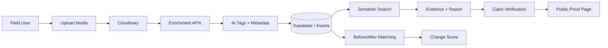

# Pramaan

Pramaan is an AI-powered evidence platform for field impact reporting. It turns raw media from projects, field visits, and sustainability programs into searchable, verifiable, and reportable evidence of real-world change.

The product is built for organizations that need to prove impact, not just describe it.

## Live links

- Live app: https://pramaan-fawn.vercel.app
- Production deployment: https://pramaan-8snljwxxq-amrit-kumars-projects-1e85dd28.vercel.app
- GitHub repository: https://github.com/amrit100612/Pramaan

## Why this project matters

## Why this project matters

Field teams often collect thousands of photos and videos during project work. But those files are usually scattered across folders, phones, and shared drives. This makes it hard to:

- prove what happened on the ground
- compare before and after conditions
- verify whether a claim is actually backed by evidence
- prevent reused or misleading images from being presented as proof
- produce credible reports for donors, communities, and stakeholders

In real life, this matters in sectors like:

- climate action and restoration
- rural development and livelihoods
- NGO monitoring and evaluation
- public health campaigns
- CSR and sustainability reporting
- environmental compliance and audits

Pramaan helps close the gap between “we said this happened” and “we can show evidence that it happened.”

## What Pramaan does

Pramaan takes uploaded field media and transforms it into a trustworthy evidence chain.

The workflow is:

1. Upload media to a project
2. Extract and enrich metadata, AI tags, and embeddings
3. Search media semantically by meaning, not file names
4. Match before/after images for change comparison
5. Evaluate claims using a trust and verdict engine
6. Generate auditable reports with evidence receipts
7. Publish a public verification page linked by QR code or asset reference

## Core workflow

### 1. Ingest media
Users upload project photos and related media through the app. Each asset is associated with a project, time, location, and context.

### 2. Enrich and analyze
The system processes each asset with AI and metadata extraction:

- image captioning and AI tagging
- semantic embeddings for search
- metadata like captured time and coordinates
- trust checks for quality and suspicious reuse

This creates structured evidence instead of a random collection of files.

### 3. Semantic search
Instead of browsing folders, users can search by meaning, such as:

- “tree plantation near a river after monsoon”
- “water access improvement in a rural village”
- “community health activity near school premises”

The system compares natural-language queries against asset embeddings and ranks the most relevant evidence.

### 4. Before and after comparison
Pramaan pairs media from the same site or similar context to show change over time. This is important when proving impact such as:

- reforestation progress
- infrastructure improvement
- education or health outreach outcomes
- land restoration and ecosystem change

### 5. Claim verification
The app evaluates claims using a verdict engine and evidence state. It checks:

- whether the media matches the claim
- whether the timing and location make sense
- whether the asset looks duplicated or suspicious
- whether the evidence supports the claim strongly enough

This reduces false reporting, weak evidence, and reused media in impact storytelling.

### 6. Report generation
The system can compile evidence into a report that ties every claim back to source media, metadata, and trust scores. This is especially valuable for:

- funder reporting
- board decks
- community communication
- compliance review
- public transparency

### 7. Public evidence verification
Each verified asset can be linked to a public verification page, which makes it easier for stakeholders to inspect the source media and validation trail without entering a private dashboard.

## Why it is important in real life

This is not just a demo for AI features. It addresses a real-world problem:

- organizations want to prove impact, not just claim it
- donor trust depends on evidence quality
- communities deserve transparency
- field data is often messy, fragmented, and hard to verify

Pramaan creates a system for accountable storytelling and evidence-based decision-making.

## Tech stack

- Next.js + TypeScript + Tailwind CSS
- App Router architecture for dashboard and API endpoints
- Cloudinary for upload, media processing, AI vision, and webhook-based enrichment
- Supabase for Postgres and vector-friendly data storage
- AI-based embeddings and judgment logic for semantic search and verification
- Vercel for deployment

## Project structure

```bash
pramaan/
├─ app/
│  ├─ (marketing)/
│  ├─ (dashboard)/
│  ├─ api/
│  ├─ verify/
│  └─ layout.tsx
├─ components/
├─ lib/
├─ public/
├─ supabase/
├─ .env.example
├─ package.json
├─ next.config.ts
├─ PRD.md
├─ Architecture.md
├─ System-Design.md
├─ Rules.md
├─ Phases.md
├─ Design.md
├─ README.md
└─ tsconfig.json
```

## Main application flow



## Key product features

- Smart ingest and project-based media organization
- AI tagging and automatic captioning
- Search by semantic meaning, not file names
- Before/after visual comparison
- Trust evaluation and duplicate detection
- Claim verification against evidence
- Evidence receipts and reporting
- QR-linked public verification pages

## Deployment

This project is designed to deploy on Vercel.

### Local development

```bash
npm install
npm run dev
```

Then open:

```bash
http://localhost:3000
```

### Production deployment

The app is configured for Vercel deployment and can be deployed directly from the connected repository.

## Environment variables

Copy the values from [.env.example](.env.example) and fill in your real credentials for:

- Cloudinary
- Supabase
- OpenAI or AI Gateway

These are required for media processing, database storage, and AI-powered verification features.

## Real-world impact

Pramaan is designed for a future where impact claims must be backed by transparent evidence. It helps teams reduce guesswork, improve trust, and make reporting more honest, useful, and defensible.

In practical terms, the system turns a pile of field media into a decision-grade evidence layer for impact work.

## License

This project is currently a prototype and is intended for project demonstration and proof-of-concept use.

## Notes

For deeper technical details, see:

- [PRD.md](PRD.md)
- [Architecture.md](Architecture.md)
- [System-Design.md](System-Design.md)
- [Rules.md](Rules.md)
- [Phases.md](Phases.md)
- [Design.md](Design.md)
