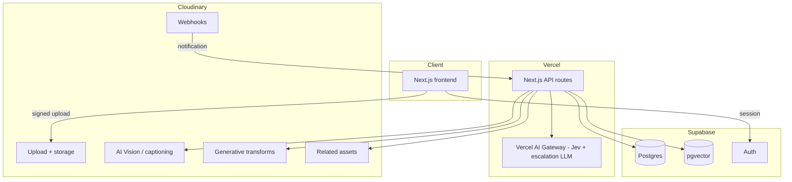
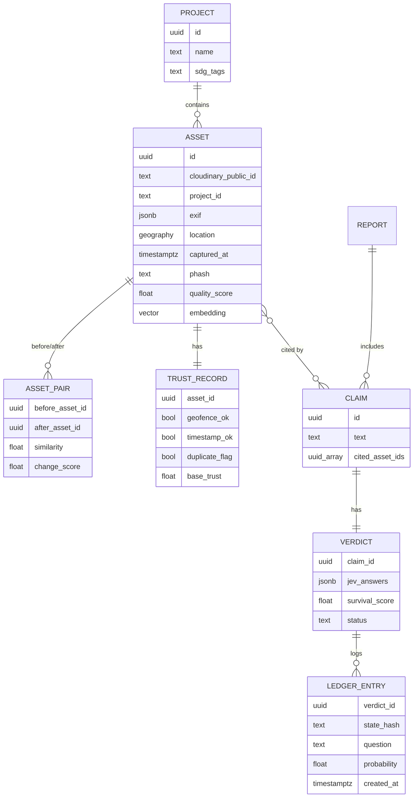
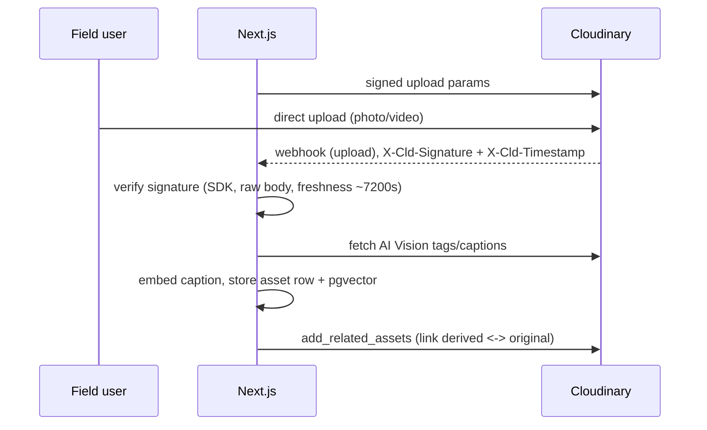
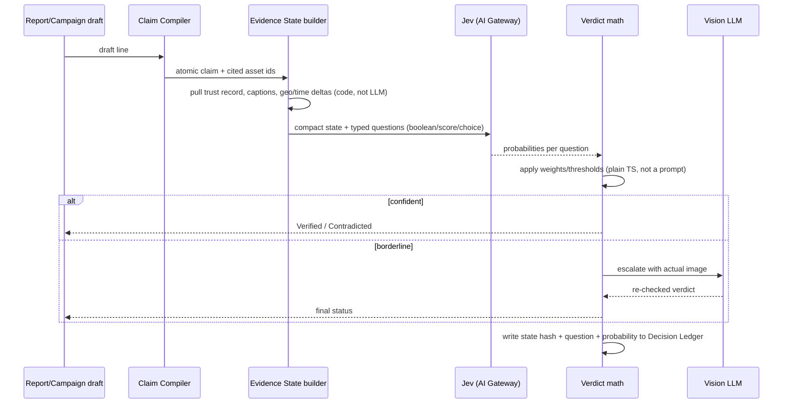

# Pramaan — System Design (HLD)

## 1. Component overview

## 2. Data model (core entities)

## 3. Sequence: ingest → enrichment

The webhook signature check must run before the body is parsed for anything else, and must hash the **raw** request bytes — Cloudinary's signature is `SHA(raw_body + timestamp + api_secret)`, a plain hash, not a keyed HMAC, so re-serializing the JSON before checking breaks verification. Retries arrive up to 3 times (roughly 3/6/9 minutes) if we don't return 200, so returning `401` on a bad signature is safe and expected — Cloudinary won't disable the endpoint for it.

## 4. Sequence: claim verification (Jev Jury)

## 5. API contract (summary)
| Endpoint | Method | Auth | Purpose |
|---|---|---|---|
| `/api/upload-signature` | POST | session | Scoped signed upload params |
| `/api/webhooks/cloudinary` | POST | signature header | Ingest notification |
| `/api/enrich` | POST | internal | Tagging + embedding |
| `/api/pair` | POST | session | Before/after candidate generation |
| `/api/claims/compile` | POST | session | Draft text → atomic claims |
| `/api/claims/verify` | POST | session | Runs Jev Jury, returns verdict |
| `/api/report` | POST | session | PDF generation |
| `/verify/:assetId` | GET | none | Public QR-target page |

## 6. Security & integrity
- **Originals stay `authenticated` delivery type**; only derived/public versions are `upload`/public — keeps a private master copy of every asset.
- **Webhook signature verification is mandatory**, not optional (see §3). Confirm `signature_algorithm` against the account — the SDK default is SHA-1, SHA-256 is opt-in.
- **Traceability is two-layered:** our own `LEDGER_ENTRY` rows, plus Cloudinary's own `add_related_assets` linking every derived/transformed asset back to its original (up to 10 related assets per call, bidirectional) — so the chain is verifiable inside Cloudinary's own library too, not only in our database.
- **Row Level Security** in Supabase: a field user can insert assets into their own project only; verdicts and ledger entries are insert-only from server routes, never client-writable.
- **Duplicate/reuse detection** via `phash` distance is a similarity signal, not proof — labeled that way in the UI (see `Design.md` states).

## 7. Scaling notes (stated honestly, for a hackathon-scale system)
- pgvector is fine up to tens of thousands of assets; at real production scale, embeddings would move to a dedicated vector store — out of scope here.
- Jev's per-question calls run in parallel already, so the number of questions per claim barely affects latency — the real cost lever is claim *volume*, controlled by the cascade (Jev on everything, the vision LLM only on the borderline slice).
- Video processing (keyframing, transcripts) is the one component worth queuing as a background job rather than running inline in a webhook handler, given typical serverless timeout limits.

## 8. Known limitations (say these on stage before a judge finds them)
- EXIF/GPS can be spoofed — the Trust Layer is described as tamper-evident, not tamper-proof.
- Jev's probabilities are only as calibrated as the labeled-set evaluation actually run in Phase 8 — quote that number, not a vendor benchmark.
- Cloudinary's premium Visual Search (Assets) feature requires Enterprise and per-asset opt-in at upload time — semantic search here is built on our own pgvector embeddings so it doesn't depend on that being enabled.
